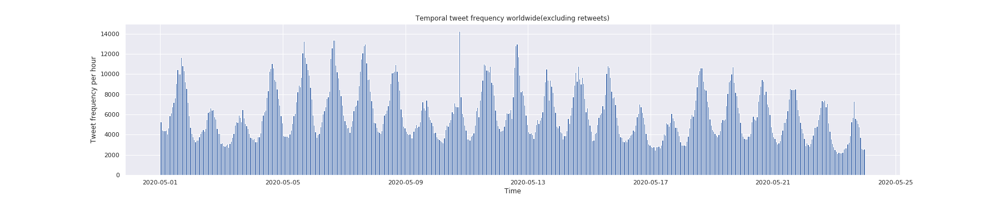
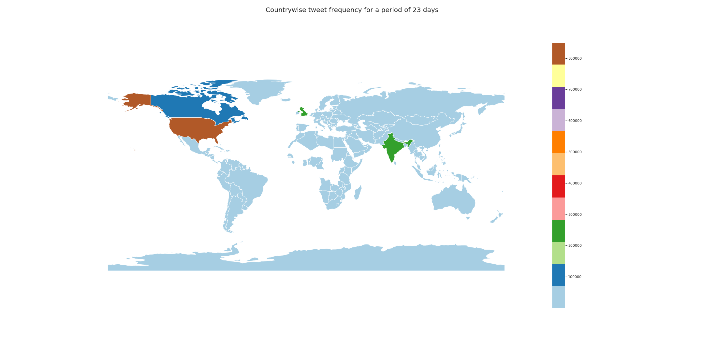
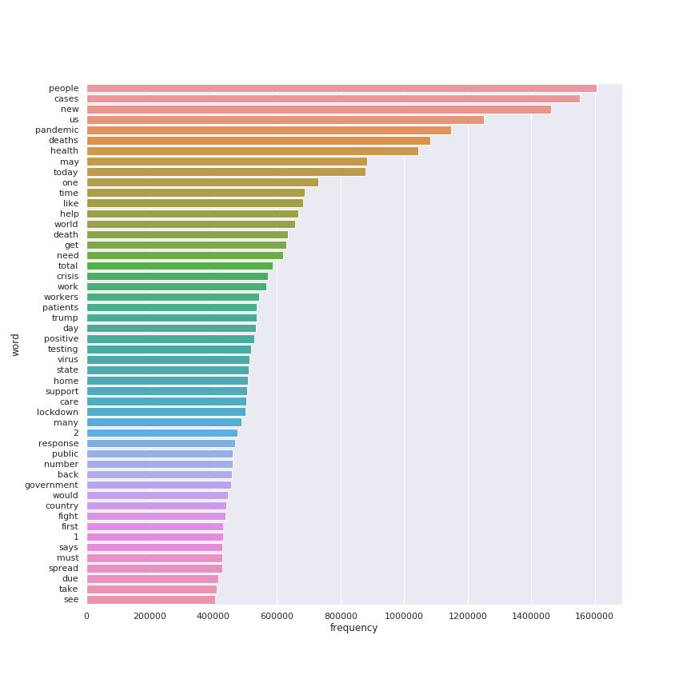
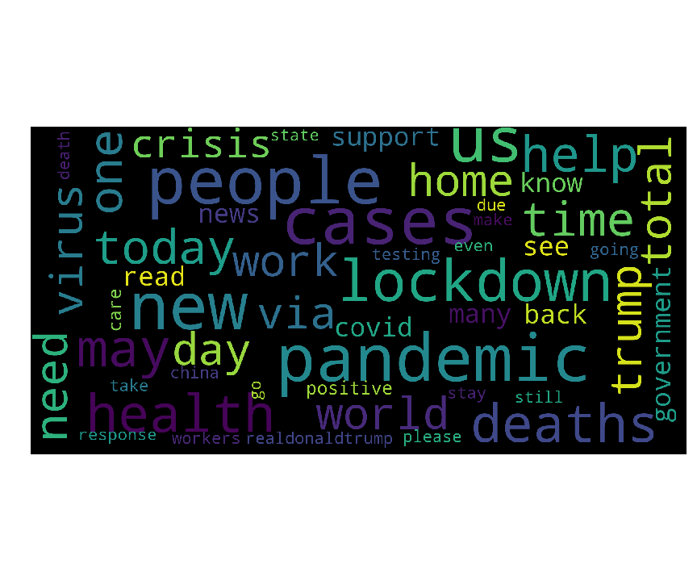
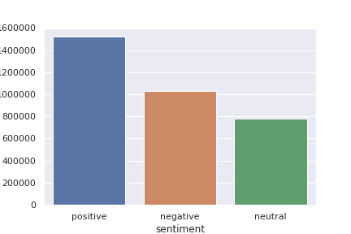
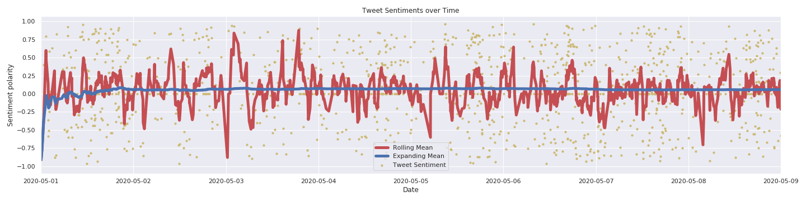
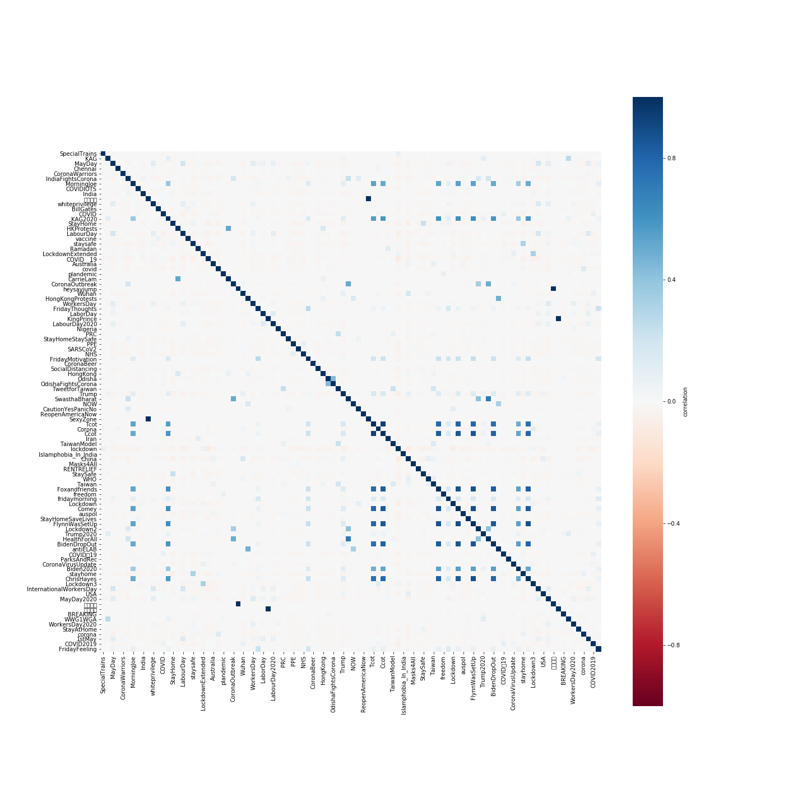

# Description

This work is motivated by the current sitiation of the world where, people have a little choice to share or communicate their opinions with people physically as they can't go out and are stuck indoors with access to the internet and Social Media. Twitter being one of the largest platforms for sharing news and ideas worldwide and having free and open access to their data online directly through their APIs is a perfect place to understand the situation and mine people's opinion on the current situation worldwide and in realtime. Everything here has been done from scratch from the dataset collection to the analysis of the data.


## 1. Data Collection

The data collection scripts monitor the twitter feeds for hashtags related to COVID-19 in English. Apart from tracking these hashtags search filters for filtering retweets is also applied and the final query is generated by 'OR'ing the hashtags as the twitter search API supports these search operators and filters. All the collection parts of the data have been automated and scheduled to run daily on a server at IITH.

```
hashtags = ["#coronavirus", "#coronavirusoutbreak", "#coronavirusPandemic", "#covid19", "#covid_19", "#epitwitter", "#ihavecorona"]
query = (" OR ").join(hashtags) + " -filter:retweets"
```

## 2. Statsistical and Sentimental analysis of the tweets

### 2.1 Statistical Ananlysis

* Temporal frequency of tweets- The frequency of tweets related to COVID-19 per hour of each day


* Spatial frequency of tweets- The map of the tweet counts countrywise


* Term frequency of tweets- The analysis of the words related to COVID-19 based on their occurences in the tweets


* Worclouds of the words- Words associated to COVID-19 mapped on a wordcloud after cleaning and processing the tweets


### 2.2 Sentiment Analysis

* Analysing sentiments of tweets- Calculating the sentiment polarities of each tweet and analysing their counts of positive, negative and neutral sentiments


* Temporal analysis of the sentiments- Analysing the rise and fall of tweet sentiments over time which can help in analysing the situations for a given time


* Spatial plot of the sentiments- Using the location data extracted from the tweets, the tweets are grouped countrywise and the mean sentiment polarity of the tweets from the country are plotted. This data can be helpful is scenarios when a drop in the mean sentiment scores of the country is detected which can imply an urgent attention or a problem coming up in that country.


* Correlations of the hashtags- Finding the correlations between the pairs of the popular hashtags associated to COVID-19. This can help up analysing the topics in trend associated to COVID-19


### 3.2 Topic Modeling

* Model topics- Find out about the topics related to COVID-19 from two popular methods:
  * Latent Dirichlet Allocation
  
  * Negative Matrix Factorization
  

# Implementation details and mechanism

## 1. Data Collection

Python has a number of libraries for accessing twitter data. Here I've used [Tweepy](http://docs.tweepy.org/en/latest/) and [Twarc](https://github.com/DocNow/twarc) as they provide an easy access to the Twitter APIs. The get_tweets script is scheduled to run every day at 00:00 GMT(05:30 IST) which then starts collecting tweets for the previous whole day using the twitter search API. The hydrate scripts is also provided for hydrating the tweets given the tweet ids. To comply with the Twitter Developer Policy, the access to the tweets publicly is only provided in the form of Tweet IDs.

## 2. Data Cleaning

### 2.1 Cleaning the data files

The cleaning of the data here implies the dropping of NaN values in the rows, removing invalid or malformed rows from the collected data, dropping duplicated rows and sorting them. These [scripts](clean_data.py) are also scheduled to run daily after the extraction of yesterday's tweets have been completed.

### 2.2 Cleaning Tweet Text

I have used some basic standard cleaning for tweets like:
- Stripping the URLs
- Stripping out hashtags
- Stripping out user mentions
- Sripping out media and symbols
- Removing numbers
- Removing punctuations
- Removing stopwords(Including the words and hashtags used for monitoring tweets from twitter)
- Stemming: Used nltk's Lancaster Stemmer for stemming the words

Also since a filter is added in the search query to remove the retweets, we do not have the tweets which were retweeted. But each tweet object contains a field: *retweet_count*. So using this value I have multiplied the tweets with their respective *retweet_count + 1* so as to make up for the retweets lost.

## 3. Implementation details

### 3.1 Getting the location data from tweets

Although twitter provides the feature to add location details to the tweets, roughly only 1% of the people opt in for location tracking by twitter or manually add location for the tweets. So getting the data direcly from the tweet data is a difficult task. So to ovecome this, we can use the user details for each tweet which contains the users location data he put in while registering for twitter. Although this might not be too precise, but we can narrow it down to atleast the country. [This paper](https://www.aaai.org/ocs/index.php/WS/AAAIW13/paper/view/7085) talks about such a work. I'm using thier code to extract the geolocation information from the tweet objects. For the visualization part, geopandas is used to map the data to the country regions and plot them on a world map.

### 3.2 Sentiment Analyser

For getting the sentiment scores for tweets, nltk's [Vader](http://comp.social.gatech.edu/papers/icwsm14.vader.hutto.pdf) has been used. The reason for choosing this analyser over other methods are the following:
-It works exceedingly well on social media type text, yet readily generalizes to multiple domains
-It doesn’t require any training data but is constructed from a generalizable, valence-based, human-curated gold standard sentiment lexicon
-It is fast enough to be used online with streaming data, and
-It does not severely suffer from a speed-performance tradeoff.

### 3.3 Stemming algorithms

I have tried Lancaster Stemmer here which is one of the strictest algortihms for stemming and much faster then Porter or SnowBall, but many of the stems generated by it were non linguistic. Snowball gave better stems for the words in the tweets, hence using them was a better option although with a speed tradeoff.

### 3.4 Vectorizing text

To Vectorize the tweet text, sklearn's [CountVetorizer](https://scikit-learn.org/stable/modules/generated/sklearn.feature_extraction.text.CountVectorizer.html) is used. 


### 3.5 Modeling Topics

Two of the most popular methods for analysing topics LDA and NMF have been used for picking topics from the tweets

### 4. On going work:
#### Creating a word network for 
